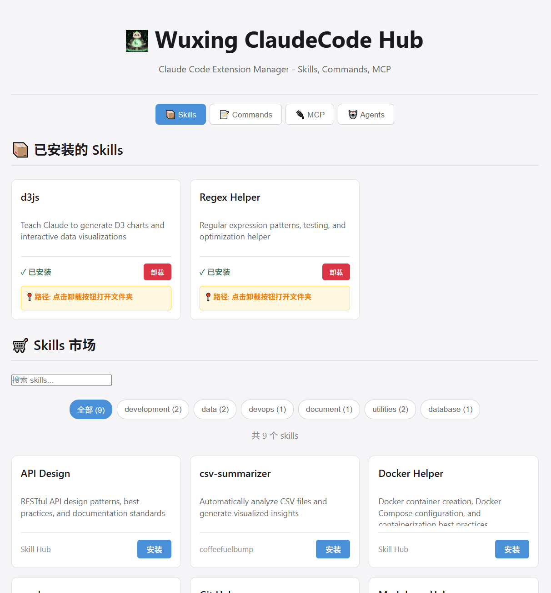
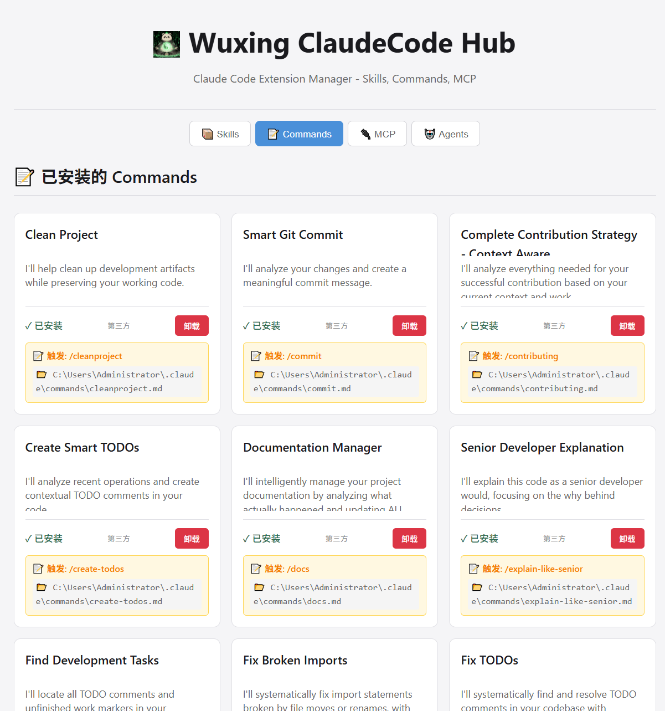
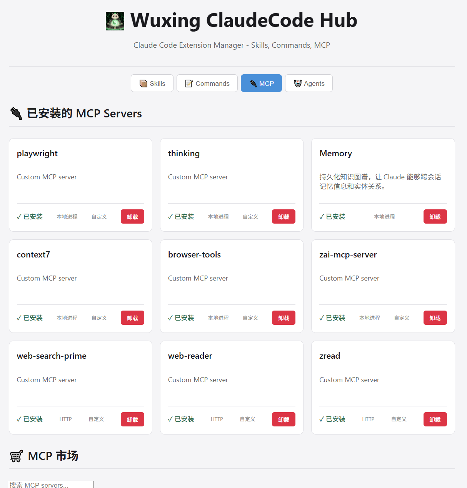
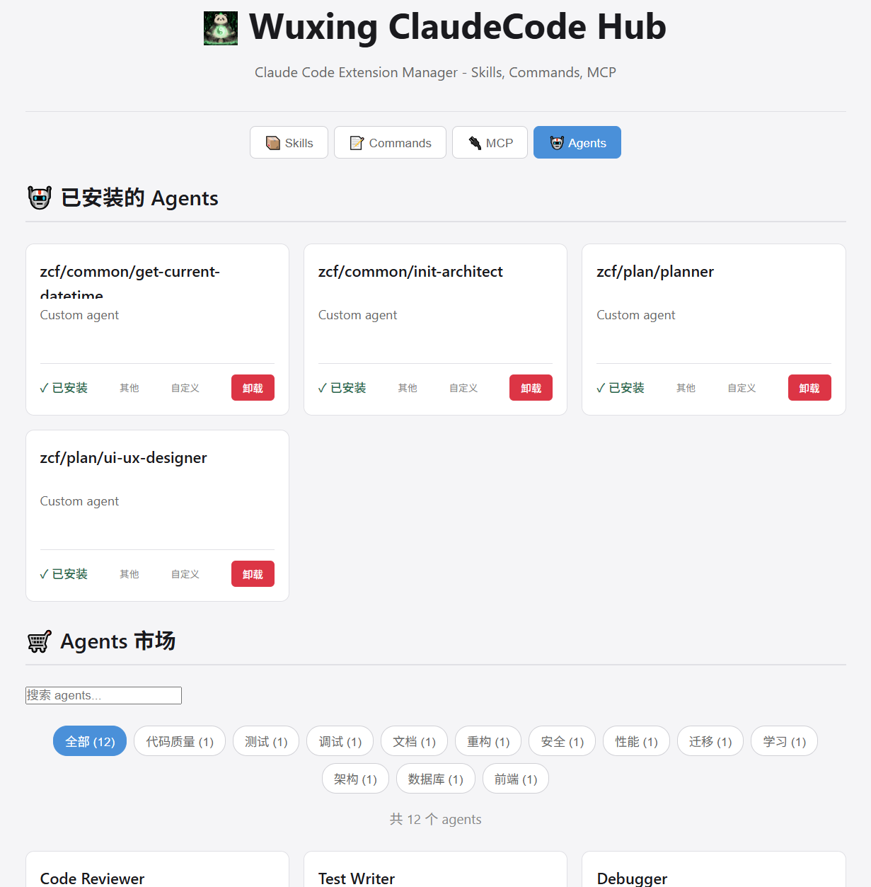

<p align="center">
  
</p>

<p align="center">
  <a href="https://github.com/MaesHughes/wuxing-claudecode-hub/blob/main/README.zh-CN.md">
    <b>English | 中文</b>
  </a>
</p>

<p align="center">
  <strong>Compatible with Claude Code, Cursor, Windsurf, Codex, Zed, and more AI-powered IDEs</strong>
</p>

<h1 align="center">Wuxing ClaudeCode Hub</h1>

<p align="center">
  <i>The Ultimate Claude Code Extension Manager</i>
</p>

<p align="center">
  <strong>Manage Skills, Commands, and MCP Servers - All in One Beautiful Interface</strong>
</p>

<p align="center">
  <a href="https://github.com/MaesHughes/wuxing-claudecode-hub">
    
  </a>
  <a href="https://github.com/MaesHughes/wuxing-claudecode-hub/blob/main/LICENSE">
    
  </a>
  
  <a href="https://blog.wuxingcodes.com/">
    
  </a>
</p>

<p align="center">
  <a href="https://blog.wuxingcodes.com/">
    
  </a>
</p>

<p align="center">
  <a href="#-features">Features</a> •
  <a href="#-quick-start">Quick Start</a> •
  <a href="#-installation">Installation</a> •
  <a href="#-usage">Usage</a> •
  <a href="#-roadmap">Roadmap</a> •
  <a href="#-contributing">Contributing</a>
</p>

---

## What is ClaudeCode Hub?

**ClaudeCode Hub** is a powerful web-based management tool for [Claude Code](https://claude.ai/code) extensions. It provides a beautiful, intuitive interface to manage:

- **📦 Skills** - Complex multi-file agent capabilities
- **📝 Commands** - Simple slash commands
- **🔌 MCP Servers** - Model Context Protocol external connectors
- **🤖 Agents** - Custom AI agent configurations

Think of it as a package manager for Claude Code - making it easy to discover, install, update, and manage all your extensions without touching the command line.

## Why ClaudeCode Hub?

Managing Claude Code extensions today means:
- Navigating hidden directories like `~/.claude/`
- Manually copying files and folders
- No way to see what's installed
- No marketplace to discover new extensions
- Risk of breaking things with manual operations

**ClaudeCode Hub solves all of this:**
- Visual interface to see all installed extensions
- One-click install from marketplace
- Safe uninstall (opens folder for manual confirmation)
- Search and filter by name, category, or description
- Support for nested command namespaces (e.g., `/zcf:feat`)

---

## Features

### ✨ Current Features

- **Skills Management**
  - Browse marketplace skills with ratings and categories
  - Install skills globally or locally
  - View installed skills with status indicators
  - Safe uninstall with folder preview

- **Commands Manager**
  - Discover slash commands from the marketplace
  - Recursive directory scanning for installed commands
  - Support for namespace commands (e.g., `/zcf:feat`)
  - YAML frontmatter parsing for descriptions
  - Filter by category or search by keyword

- **MCP Servers Management**
  - Browse marketplace MCP servers (including Wuxing Search)
  - View installed servers with configuration details
  - Easy config file access for manual setup
  - Support for stdio and HTTP transport types

- **Agents Management**
  - View all installed AI agents
  - Browse marketplace agent templates
  - Custom agent creation support
  - YAML frontmatter metadata parsing

- **Beautiful Web Interface**
  - Modern, responsive design
  - Dark mode optimized
  - Real-time search and filtering
  - Tab-based navigation for Skills, Commands, MCP, and Agents

- **Safety First**
  - Opens folders for manual uninstall (no auto-delete)
  - Security checks to prevent path traversal
  - Clear confirmation dialogs

### 🚀 Coming Soon

- **Extension Ratings & Reviews** - Community feedback system
- **Installation History** - Track your extension installations
- **Batch Operations** - Install/uninstall multiple extensions at once
- **More Extensions** - Continuously adding quality community extensions

---

## Quick Start

Get started in 3 simple steps:

### 1. Install

```bash
npm install -g @wuxing/wuxing-claudecode-hub
```

### 2. Launch

```bash
claude-hub
```

### 3. Enjoy!

The web interface will automatically open in your browser at `http://localhost:3807`

---

## Installation

### Quick Start with npx (Recommended)

No installation required - just run:

```bash
npx github:MaesHughes/wuxing-claudecode-hub
```

That's it! The tool will automatically download and launch the web interface.

---

### Alternative: Clone from GitHub

If you prefer to clone the repository:

```bash
git clone https://github.com/MaesHughes/wuxing-claudecode-hub.git
cd wuxing-claudecode-hub
npm install
npm link
claude-hub
```

---

## Usage

### Starting the Web Interface

```bash
# Default port (3807)
claude-hub

# Custom port
PORT=4000 claude-hub
```

The interface will open automatically. Use it to:
- Browse and install Skills
- Discover and install Commands
- Configure MCP Servers
- Manage AI Agents
- View your installed extensions
- Uninstall extensions safely

### CLI Options

```bash
claude-hub              # Start the web interface
claude-hub --help       # Show help message
claude-hub --version    # Show version information
```

### Web Interface

Open `http://localhost:3807` in your browser to access the full management interface.

---

## Screenshots

<div align="center">
  
  <p><em>📦 Skills Management - Browse and Install</em></p>
</div>

<div align="center">
  
  <p><em>📝 Commands Management - Discover Slash Commands</em></p>
</div>

<div align="center">
  
  <p><em>🔌 MCP Servers Management - Configure External Tools</em></p>
</div>

<div align="center">
  
  <p><em>🤖 Agents Management - AI Agent Configuration</em></p>
</div>

---

## Extension Types

ClaudeCode Hub manages four main types of Claude Code extensions:

### 📦 Skills
Complex, multi-file capabilities that extend Claude's abilities. Skills are like plugins that can include their own code, configuration, and documentation.

### 📝 Commands
Simple markdown-based slash commands. Great for quick workflows, templates, and repetitive tasks. Supports namespaces like `/zcf:feat`.

### 🔌 MCP Servers
Model Context Protocol servers that connect Claude to external tools, databases, and APIs. Configure stdio or HTTP transport types with custom settings.

> **💡 Featured: [Wuxing Search](https://github.com/MaesHughes/wuxing-search-mcp)** - A free, unlimited search MCP powered by SearXNG. Aggregates 100+ search engines with no API costs or rate limits. Perfect for course development and research.

### 🤖 Agents
Custom AI agent configurations with YAML frontmatter metadata. Create specialized agents for specific tasks with custom prompts and behaviors.

---

## Roadmap

### v1.0 (Current)
- [x] Skills management
- [x] Commands management
- [x] MCP Servers management
- [x] Agents management
- [x] Web interface with Skills/Commands/MCP/Agents tabs
- [x] YAML frontmatter parsing
- [x] Namespace command support
- [x] Safe uninstall approach

### v1.5 (Q1 2026)
- [ ] Extension ratings and reviews
- [ ] Installation history
- [ ] Batch operations
- [ ] More marketplace extensions

### v2.0 (Q2 2026)
- [ ] Cloud sync
- [ ] Team collaboration
- [ ] Private extension marketplace
- [ ] CLI improvements

### v3.0 (Q4 2026)
- [ ] Workflow orchestration
- [ ] Extension dependencies
- [ ] Version management
- [ ] Enterprise features

---

## Development

```bash
# Clone the repository
git clone https://github.com/MaesHughes/wuxing-claudecode-hub.git
cd wuxing-claudecode-hub

# Install dependencies
npm install

# Start development server
npm start

# Run with auto-reload (recommended for development)
npm run dev
```

### Project Structure

```
claudecode-hub/
├── bin/              # CLI entry point
├── server/           # Express backend
├── public/           # Frontend HTML/CSS/JS
├── skills/           # Marketplace skills
├── commands/         # Marketplace commands
├── assets/           # Documentation images
└── docs/             # Additional documentation
```

---

## Contributing

We welcome contributions from the community! Here's how you can help:

1. **Fork** the repository
2. **Create** a feature branch (`git checkout -b feature/amazing-feature`)
3. **Commit** your changes (`git commit -m 'Add amazing feature'`)
4. **Push** to the branch (`git push origin feature/amazing-feature`)
5. **Open** a Pull Request

Please read our [Contributing Guidelines](CONTRIBUTING.md) for more details.

### Ways to Contribute

- Add new skills or commands to the marketplace
- Report bugs and issues
- Suggest new features
- Improve documentation
- Share your feedback

---

## Resources

### 📖 [Official Blog](https://blog.wuxingcodes.com/)
Latest updates, tutorials, and insights about ClaudeCode Hub and AI development.

### 📚 Documentation
- [Installation Guide](https://github.com/MaesHughes/wuxing-claudecode-hub/wiki/Installation)
- [User Guide](https://github.com/MaesHughes/wuxing-claudecode-hub/wiki/User-Guide)
- [API Reference](https://github.com/MaesHughes/wuxing-claudecode-hub/wiki/API)

### 💬 Community
- [GitHub Discussions](https://github.com/MaesHughes/wuxing-claudecode-hub/discussions) - Ask questions and share ideas
- [GitHub Issues](https://github.com/MaesHughes/wuxing-claudecode-hub/issues) - Report bugs

### 🌐 Social
- Follow our blog: [blog.wuxingcodes.com](https://blog.wuxingcodes.com/)
- Star us on GitHub if you find this project helpful!

---

## License

[MIT License](LICENSE) - see [LICENSE](LICENSE) file for details.

---

## Acknowledgments

- Built for the [Claude Code](https://claude.ai/code) community
- Inspired by the need for better extension management
- Thanks to all contributors and users

---

<div align="center">

**Made with ❤️ by the Wuxing team**

**⭐ Star us on GitHub — it helps!**

</div>
