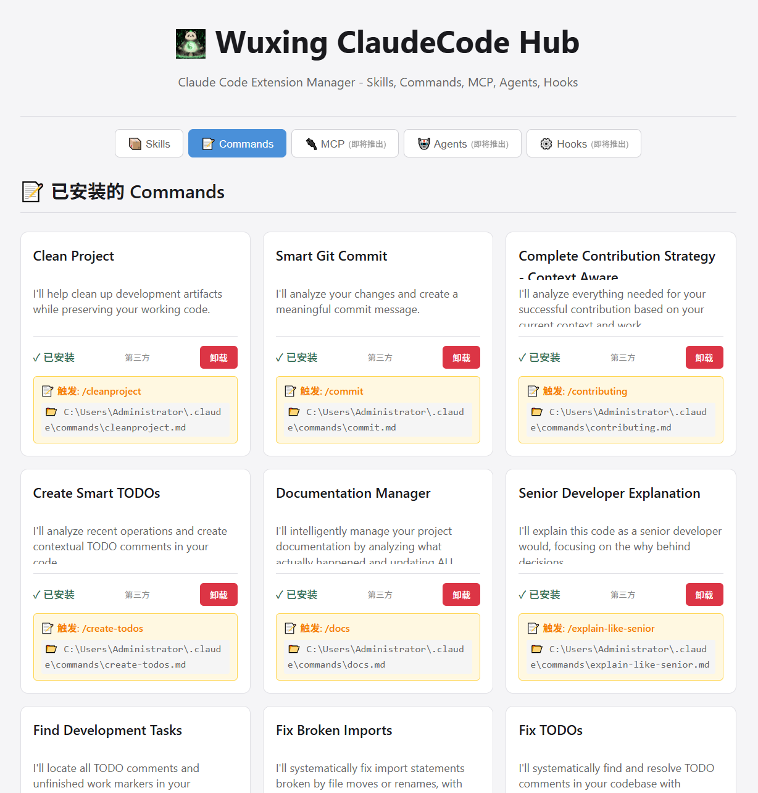
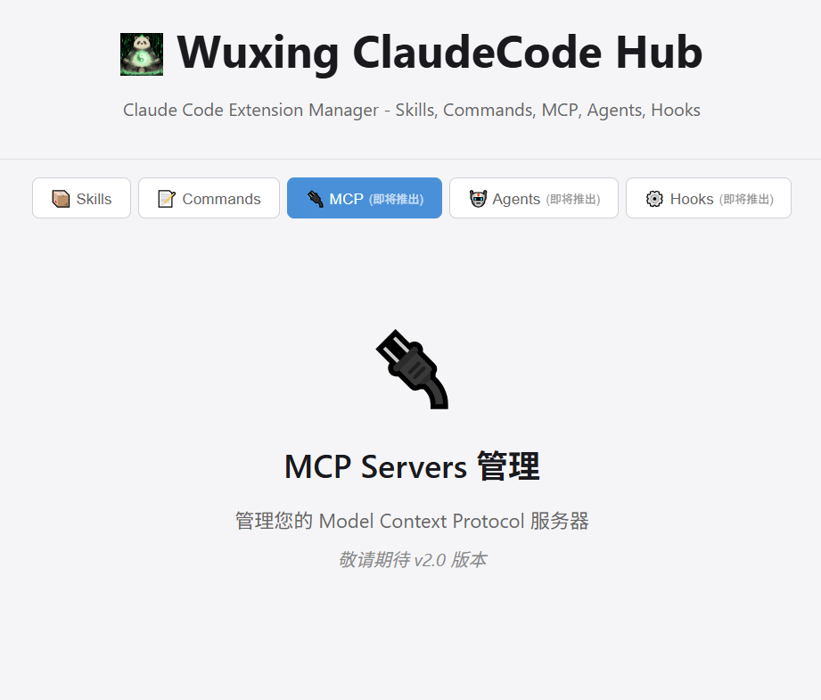

<p align="center">
  
</p>

<h1 align="center">Wuxing ClaudeCode Hub</h1>

<p align="center">
  <i>Claude Code 扩展管理终极工具</i>
</p>

<p align="center">
  <strong>一站式管理 Skills、Commands 和 MCP Servers</strong>
</p>

<p align="center">
  <a href="https://github.com/MaesHughes/wuxing-claudecode-hub">
    
  </a>
  <a href="https://github.com/MaesHughes/wuxing-claudecode-hub/blob/main/LICENSE">
    
  </a>
  
  <a href="https://blog.wuxingcodes.com/">
    
  </a>
</p>

<p align="center">
  <a href="https://blog.wuxingcodes.com/">
    
  </a>
</p>

<p align="center">
  <a href="#-功能特性">功能特性</a> •
  <a href="#-快速开始">快速开始</a> •
  <a href="#-安装">安装</a> •
  <a href="#-使用方法">使用方法</a> •
  <a href="#-开发路线">开发路线</a> •
  <a href="#-贡献指南">贡献指南</a>
</p>

---

## 什么是 ClaudeCode Hub？

**ClaudeCode Hub** 是一款强大的基于 Web 的 [Claude Code](https://claude.ai/code) 扩展管理工具。它提供了美观、直观的界面来管理：

- **Skills** - 复杂的多文件 Agent 能力
- **Commands** - 简单的斜杠命令
- **MCP Servers** - 模型上下文协议外部连接器

可以把它理解为 Claude Code 的包管理器 —— 让你能够轻松发现、安装、更新和管理所有扩展，无需触碰命令行。

> **注意：** 我们还提供 [Hooks 配置模板](https://github.com/MaesHughes/wuxing-claudecode-hub/wiki/Hooks-Guide) 用于自动化工作流。

## 为什么选择 ClaudeCode Hub？

如今管理 Claude Code 扩展意味着：
- 导航到 `~/.claude/` 等隐藏目录
- 手动复制文件和文件夹
- 无法查看已安装的内容
- 没有市场来发现新扩展
- 手动操作有风险

**ClaudeCode Hub 解决了所有这些问题：**
- 可视化界面查看所有已安装的扩展
- 一键从市场安装
- 安全卸载（打开文件夹供手动确认）
- 按名称、类别或描述搜索和过滤
- 支持嵌套命令命名空间（例如 `/zcf:feat`）

---

## 功能特性

### ✨ 当前功能

- **Skills 管理**
  - 浏览市场技能，查看评分和分类
  - 全局或本地安装技能
  - 查看已安装技能及状态指示器
  - 安全卸载并预览文件夹

- **Commands 管理**
  - 从市场发现斜杠命令
  - 递归扫描已安装的命令
  - 支持命名空间命令（例如 `/zcf:feat`）
  - 解析 YAML frontmatter 描述
  - 按类别过滤或关键字搜索

- **精美的 Web 界面**
  - 现代响应式设计
  - 深色模式优化
  - 实时搜索和过滤
  - 五件套标签页导航

- **安全第一**
  - 打开文件夹手动卸载（无自动删除）
  - 安全检查防止路径遍历
  - 清晰的确认对话框

### 🚀 即将推出

- **MCP Servers 管理** - 浏览和配置模型上下文协议服务器
- **云端同步** - 跨设备同步扩展（Pro 功能）
- **团队协作** - 与团队共享扩展配置（Pro 功能）
- **Hooks 模板** - 开箱即用的自动化配置（文档）

---

## 快速开始

只需 3 步即可开始：

### 1. 安装

```bash
npm install -g @wuxing/wuxing-claudecode-hub
```

### 2. 启动

```bash
claude-hub
```

### 3. 享受！

Web 界面将自动在浏览器中打开，地址为 `http://localhost:3807`

---

## 安装

### 使用 npx 快速启动（推荐）

无需安装，直接运行：

```bash
npx github:MaesHughes/wuxing-claudecode-hub
```

就这么简单！工具会自动下载并启动 Web 界面。

---

### 备选方案：从 GitHub 克隆

如果你更喜欢克隆仓库：

```bash
git clone https://github.com/MaesHughes/wuxing-claudecode-hub.git
cd wuxing-claudecode-hub
npm install
npm link
claude-hub
```

---

## 使用方法

### 启动 Web 界面

```bash
# 默认端口（3807）
claude-hub

# 自定义端口
PORT=4000 claude-hub
```

界面将自动打开。使用它可以：
- 浏览和安装 Skills
- 发现和安装 Commands
- 查看已安装的扩展
- 安全卸载扩展

### CLI 选项

```bash
claude-hub              # 启动 Web 界面
claude-hub --help       # 显示帮助信息
claude-hub --version    # 显示版本信息
```

### Web 界面

在浏览器中打开 `http://localhost:3807` 访问完整的管理界面。

---

## 界面截图

<div align="center">
  
  <p><em>Skills 管理 - 浏览和安装</em></p>
</div>

<div align="center">
  
  <p><em>Commands 管理 - 发现斜杠命令</em></p>
</div>

<div align="center">
  
  <p><em>MCP Servers 管理 - 即将推出</em></p>
</div>

---

## 扩展类型

ClaudeCode Hub 管理三种主要的 Claude Code 扩展：

### 📦 Skills
复杂的多文件能力，扩展 Claude 的功能。Skills 类似于插件，可以包含自己的代码、配置和文档。

### 📝 Commands
基于 Markdown 的简单斜杠命令。适用于快速工作流、模板和重复性任务。支持命名空间如 `/zcf:feat`。

### 🔌 MCP Servers
模型上下文协议服务器，将 Claude 连接到外部工具、数据库和 API。*（即将推出）*

---

### 📚 其他资源

**Hooks 配置**
虽然 Hooks 不通过 Web 界面管理，但我们提供全面的文档和模板来设置自动化工作流：
- [Hooks 配置指南](https://github.com/MaesHughes/wuxing-claudecode-hub/wiki/Hooks-Guide)
- [常用 Hooks 模板](https://github.com/MaesHughes/wuxing-claudecode-hub/wiki/Hooks-Templates)

---

## 开发路线

### v1.0（当前）
- [x] Skills 管理
- [x] Commands 管理
- [x] Skills/Commands/MCP 标签页 Web 界面
- [x] YAML frontmatter 解析
- [x] 命名空间命令支持
- [x] 安全卸载方式

### v1.5（2026 Q1）
- [ ] MCP Servers 管理
- [ ] 扩展评分和评论
- [ ] 安装历史
- [ ] 批量操作
- [ ] Hooks 文档和模板

### v2.0（2026 Q2）
- [ ] 云端同步（Pro）
- [ ] 团队协作（Pro）
- [ ] 私有扩展市场
- [ ] CLI 改进

### v3.0（2026 Q4）
- [ ] 工作流编排
- [ ] 扩展依赖管理
- [ ] 版本管理
- [ ] 企业功能

---

## 开发

```bash
# 克隆仓库
git clone https://github.com/MaesHughes/wuxing-claudecode-hub.git
cd wuxing-claudecode-hub

# 安装依赖
npm install

# 启动开发服务器
npm start

# 自动重新加载（推荐用于开发）
npm run dev
```

### 项目结构

```
claudecode-hub/
├── bin/              # CLI 入口
├── server/           # Express 后端
├── public/           # 前端 HTML/CSS/JS
├── skills/           # 市场技能
├── commands/         # 市场命令
├── assets/           # 文档图片
└── docs/             # 附加文档
```

---

## 贡献指南

我们欢迎社区贡献！以下是如何参与：

1. **Fork** 仓库
2. **创建** 功能分支（`git checkout -b feature/amazing-feature`）
3. **提交** 更改（`git commit -m 'Add amazing feature'`）
4. **推送** 到分支（`git push origin feature/amazing-feature`）
5. **创建** Pull Request

请阅读我们的[贡献指南](CONTRIBUTING.md)了解更多详情。

### 贡献方式

- 向市场添加新的技能或命令
- 报告问题和缺陷
- 建议新功能
- 改进文档
- 分享你的反馈

---

## 相关资源

### 📖 [官方博客](https://blog.wuxingcodes.com/)
关于 ClaudeCode Hub 和 AI 开发的最新更新、教程和见解。

### 📚 文档
- [安装指南](https://github.com/MaesHughes/wuxing-claudecode-hub/wiki/Installation)
- [用户指南](https://github.com/MaesHughes/wuxing-claudecode-hub/wiki/User-Guide)
- [API 参考](https://github.com/MaesHughes/wuxing-claudecode-hub/wiki/API)

### 💬 社区
- [GitHub 讨论](https://github.com/MaesHughes/wuxing-claudecode-hub/discussions) - 提问和分享想法
- [GitHub Issues](https://github.com/MaesHughes/wuxing-claudecode-hub/issues) - 报告问题

### 🌐 关注我们
- 关注博客：[blog.wuxingcodes.com](https://blog.wuxingcodes.com/)
- 如果这个项目对你有帮助，请在 GitHub 上点个 Star！

---

## 商业模式

ClaudeCode Hub 是**开源软件（MIT 许可证）**，将始终提供免费版本。

**当前（v1.0）：** 完全免费开源。

**未来的 Pro 功能：**
- 跨设备云端同步
- 团队协作
- 私有扩展市场
- 使用分析和推荐
- 优先支持

我们的目标是先为社区构建有用的工具，然后为高级用户和团队引入可选的付费功能。

---

## 许可证

[MIT 许可证](LICENSE) - 详见 [LICENSE](LICENSE) 文件。

---

## 致谢

- 为 [Claude Code](https://claude.ai/code) 社区而构建
- 源于对更好扩展管理的需求
- 感谢所有贡献者和用户

---

<div align="center">

**由 Wuxing 团队用 ❤️ 打造**

**[🇨🇳 中文](README.zh-CN.md) | [🇺🇸 English](README.md)**

**⭐ 如果觉得有帮助，请在 GitHub 上点个 Star — 这对我们很重要！**

</div>
